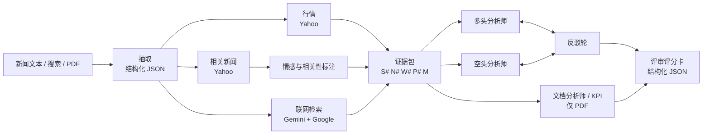

# Stock Commentary Studio · 股评工作台 v2

输入一条财经新闻、一个股票代码，或一份 PDF 年报，系统会先抽取涉及的公司和关键事实，再拉取实时行情和相关报道，然后让不同风格的分析师进行多空辩论，最后由评审给出带引用的评分卡。

这是 2025 年城大 IS6620 Project 3 [Stock Commentary Generator](https://huggingface.co/spaces/heyjudy/2025_CityU_IS6620_Project3) 的重制版。

> 仅供学习研究。生成内容可能有误，不构成任何投资建议。

## 和 v1 相比改了什么

| 模块 | v1（2025） | v2 |
|---|---|---|
| 模型 | 本地 Llama-3.2-1B（免费 CPU 上每次点击都重新加载）+ GLM-4 | DeepSeek V4 / Gemini 走 API，型号在 `config/models.ts` 集中配置，可用环境变量覆盖 |
| 找公司 | 400 多个硬编码关键词加正则（"don't" 里的 t 会被当成 AT&T 的代码 T） | 模型结构化抽取，输出 Yahoo 代码，支持港股 `0700.HK`、A 股 `.SS` / `.SZ` |
| 行情 | yfinance，把宏观词也拿去查价格 | 先校验代码再查价，附 90 天走势、均线、52 周区间 |
| 新闻 | NewsAPI（免费版 24 小时延迟、每天 100 次，`&` 会截断 URL） | Yahoo Finance 新闻（不需要 key），可选 Gemini + Google 搜索联网检索 |
| 情感分析 | SST-2 影评模型，在循环里反复加载 | 模型结合事件判断情感和相关性，并附理由 |
| 观点 | Bullish / Bearish / Neutral；"All" 实际按 neutral 处理 | **多空辩论**：双方开场，再互相反驳，最后评审裁决 |
| 分析师风格 | 写死在代码里 | `config/personas.ts`，中英双语，最多同时 3 位 |
| Step-by-Step | 手写思维链示例 | 推理模型（DeepSeek thinking / Gemini thinking），思考过程可以展开查看 |
| PDF RAG | 只截前 3000 字 | 浏览器本地解析并分页分块；长文档用混合检索（BM25 + 向量，RRF 融合）；每条结论标注页码；支持关键指标表和文档问答 |
| 评级 | 自由文本里的 BUY/SELL 和目标价 | 结构化评分卡：五个维度打分、共识与分歧、风险、信息缺口，每项都带引用 |
| Prompt | 一个 1100 行的类里反复复制长 prompt，并要求模型"编造合理理由" | `lib/prompts/` 按用途拆分并带版本号；要求**立场鲜明，但每个事实都要有引用** |
| Key | 写在代码里 | 只在服务端读取环境变量；可选访问码 + 限流 |

## 架构



所有阶段通过 `/api/analyze` 以 NDJSON 流式推给浏览器，前端边收边渲染。

```
app/                 页面和 API 路由（analyze / ask / embed / news-search / config）
components/          界面组件
config/              模型、分析师风格、演示案例（纯数据，改这里不用动逻辑）
public/demos/        演示案例的完整结果（npm run demos 生成）
lib/llm/providers.ts 唯一读取 API key 的地方
lib/prompts/         按用途拆分的 prompt 模板
lib/pipeline/        分析流程编排
lib/tools/           行情、新闻、联网检索
lib/client/          浏览器端：PDF 解析、混合检索、流式状态、历史记录
eval/                离线评测脚本
```

## 本地运行

需要 Node 22 或更高版本。

```bash
npm install
cp .env.example .env.local   # 填入至少一个模型 key
npm run dev                  # http://localhost:3000
npm run dev:proxy            # 本地需要走代理访问 Gemini 时用这个
```

| 变量 | 说明 |
|---|---|
| `DEEPSEEK_API_KEY` | [DeepSeek 开放平台](https://platform.deepseek.com/api_keys)，按量付费 |
| `GOOGLE_GENERATIVE_AI_API_KEY` | [Google AI Studio](https://aistudio.google.com/apikey)。启用 Gemini、联网检索和 PDF 向量检索 |
| `TAVILY_API_KEY` | 可选。[Tavily](https://app.tavily.com) 免费档每月 1,000 次。联网检索优先用它 |
| `ACCESS_CODE` | 可选。设置后，公开站点要先输入访问码才能运行分析 |
| `RATE_LIMIT_PER_HOUR` | 可选。每个 IP 每小时的请求上限，默认 30 |

两个模型 key 至少配一个。只配 DeepSeek 时，向量检索不可用，PDF 检索会退回到 BM25。

联网检索按顺序兜底：Tavily（带文章摘要）→ Gemini + Google 搜索 → Google News RSS（不需要 key，只有标题）。相关新闻用 Yahoo Finance 按代码的 RSS（带摘要）和 Yahoo 搜索，都不需要 key。

## 部署到 Vercel（免费 Hobby 计划）

1. 把本仓库推送到 GitHub。
2. 在 [vercel.com/new](https://vercel.com/new) 导入这个仓库，框架会自动识别为 Next.js。
3. 在 Project Settings → Environment Variables 填入上面的变量，**强烈建议设置 `ACCESS_CODE`**，避免公开链接被别人刷你的 API 额度。
4. 点 Deploy。之后每次 `git push` 都会自动重新部署。

注意事项：
- Hobby 计划仅限非商业用途。
- `vercel.json` 把服务器函数固定在美国东部（`iad1`）。Gemini API 不支持香港和中国大陆地区，**不要把区域改成 `hkg1`**，否则 Gemini 调用会失败。DeepSeek 在哪个区域都能用。
- 函数执行时长有上限：`app/api/analyze/route.ts` 里设置的是 `maxDuration = 300`，如果部署时提示超出你的计划限制，就调低这个值。
- PDF 在浏览器里解析，所以不受 Vercel 约 4.5MB 请求体积的限制。
- 限流是按单个服务器实例在内存里计数的，只能延缓滥用。流量大的话要换成 Upstash 等外部存储。

## 演示案例

三个输入方式各有演示案例，打开时直接读取 `public/demos/` 里存好的结果，**不调用 API、不消耗 token**，并标注资料日期和生成日期：

| 标签页 | 案例 | 资料来源 |
|---|---|---|
| 新闻文本 | 特斯拉交付、英伟达（三位分析师）、腾讯港股、美联储与利率 | Yahoo Finance 按代码的 RSS（带摘要）；宏观类用 Google News RSS |
| 搜索新闻 | Meta · Muse AI 助手（英文新闻）、腾讯 · WorkBuddy（中文新闻） | Google News，每个案例从指定的 3 家媒体各取一篇 |
| PDF 报告 | Meta 2026 年 Q2 财报新闻稿 | Meta 投资者关系网站的官方 PDF |

PDF 原件不放进仓库。生成时下载到 `scripts/.cache/`（已被 git 忽略），演示结果里只保留每段不超过 200 字的引用预览，并附官方原文链接。

只有修改输入（或点「重新生成」）才会实时调用。更新演示：

```bash
npm run demos -- --dry                        # 先看抓到的输入
npm run demos                                 # 全部重新生成（中英两份）
npm run demos -- --only meta-q2-2026 --lang zh   # 只重做某个案例的某种语言
```

演示结果也是模型生成的，重新生成后建议抽查关键数字。比如财报案例曾把"剔除汇率影响后的营收"误写成营收，重新生成后已修正。

## 评测

```bash
npm run eval                                 # 用所有已配置的模型跑 4 个演示案例的输入
npm run eval -- --providers gemini --mode single
```

结果写入 `eval/results/`，指标包括：
- 主标的识别率
- 引用有效率：引用的编号是否真实存在
- 引用密度
- 耗时
- 交叉评分：由另一家模型打分（立场一致性、证据支撑、交锋质量、清晰度）

## 已知限制

- 在香港或大陆本地开发时，Node 不会读取 Windows 的系统代理，直接调用 Gemini 会报 "User location is not supported"。解决办法：在 `.env.development.local` 里写好代理地址（模板见 `.env.example`），然后用 `npm run dev:proxy` 启动。如果代理软件开的是 TUN（全局）模式，就不需要这一步。DeepSeek 不受影响。
- Gemini 免费档的每分钟请求数很低，一次多空辩论会调用 6–8 次模型，容易触发限流。两个 key 都配了的话，失败的那一步会自动改用另一家模型完成，并在结果里标 "(fallback)"。联网检索（Google 搜索）可能不在免费额度内，额度可以在 [ai.dev/rate-limit](https://ai.dev/rate-limit) 查看。
- `*.vercel.app` 域名在中国大陆经常无法访问，香港正常。绑定自己的域名会改善一些，但不能保证。
- Yahoo Finance 是非官方接口，偶尔会限流或改字段。
- Yahoo 的新闻搜索不接受中文关键词。中文输入会先由模型翻译成英文名或代码，所以需要配置模型 key。
- 扫描版 PDF 没有文本层，无法解析，需要先 OCR。
- 历史记录只保存在当前浏览器（localStorage），不会同步到其他设备。
